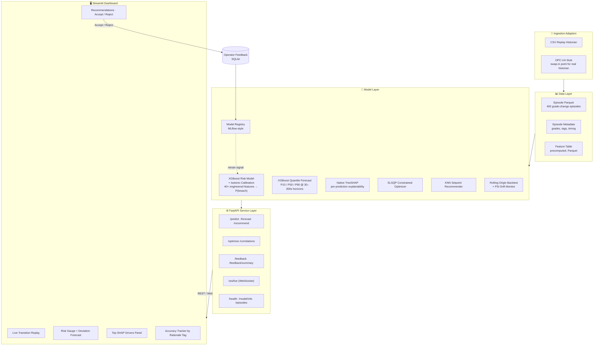

<div align="center">

# 📈 Grade Change Intelligence
### A Predictive Co-Pilot for Paper Machine Grade Transitions

**Cuts basis-weight breach risk during MD grade changes by combining a calibrated ML risk model, quantile forecasting, SHAP explainability, and an operator feedback loop — deployable alongside any existing QCS.**

[](https://www.python.org/)
[](https://fastapi.tiangolo.com/)
[](https://xgboost.readthedocs.io/)
[](https://streamlit.io/)
[](https://www.docker.com/)
[](.github/workflows/ci.yml)
[](LICENSE)

[**🔴 Live Demo**](https://intelligent-grade-change-system-bc3acqzu4dg3outmzvwcdy.streamlit.app/) · [Why This Exists](#-the-problem) · [Architecture](#-architecture) · [Quick Start](#-quick-start) · [API](#-api-reference) · [Path to Production](#-honest-path-to-production)

</div>

---

## 🖼 Demo

**▶ [Try the live dashboard here](https://intelligent-grade-change-system-bc3acqzu4dg3outmzvwcdy.streamlit.app/)** — no install needed. Select an episode from the sidebar and scrub the time slider to see risk scores, SHAP drivers, and recommendations update live.

> **TODO (do this before sharing the link with anyone):** record a 15–20s screen capture of the dashboard above — select an episode, scrub the time slider, and show a recommendation being generated and accepted — convert it to a GIF, drop it in `docs/demo.gif`, and embed it below. This is the single highest-leverage thing you can add; a recruiter will watch a 15-second GIF before reading a single line of text.

```md

```

Until the GIF is in place, add 2–3 static screenshots instead (dashboard overview, risk gauge + SHAP panel, recommendation/feedback panel):

```md
<p align="center">
  
  
</p>
```

---

## 🎯 The Problem

Grade changes on a paper machine — switching MD (machine-direction) basis weight setpoints between products — are one of the highest-risk windows in the process. During the transition, basis weight can swing outside the ±2.5% tolerance band, producing off-spec paper, wasted fiber, and lost machine time. Existing QCS (quality control systems) control the loops that are configured, but:

- They don't tell an operator **how likely** the current transition is to breach spec *before* it happens.
- They don't explain **why** a transition is risky in terms an operator can act on.
- They don't surface correlations between tags that live **outside** the configured control loops.
- Nothing captures whether an operator's corrective action actually **worked**, so the plant never learns from its own history.

**Grade Change Intelligence** is a layer that sits on top of the existing QCS/historian and closes that loop: predict → explain → recommend → capture feedback → improve.

> ⚠️ **Scope note (read this before the code):** this is a portfolio-grade MVP built and validated on a **synthetic historian dataset** (400 generated grade-change episodes) designed to mimic realistic basis-weight, actuator, and grade-change dynamics. It is an architecture and methodology demonstration, not a production-validated control system — see [Path to Production](#-honest-path-to-production) for exactly what separates it from a mill-ready deployment.

---

## ✨ What It Actually Does

| Capability | Detail |
|---|---|
| **Breach risk prediction** | Calibrated XGBoost classifier outputs `P(basis-weight breach > ±2.5%)` at any step of a live transition |
| **Explainability** | Native TreeSHAP — every risk score ships with the signed, tag-level drivers behind it, not a black box number |
| **Deviation forecasting** | Quantile regression (P10/P50/P90) projects basis-weight deviation at 30s / 60s / 120s / 300s horizons |
| **Setpoint recommendations** | KNN-based recommender proposes a corrective tag/value pair with a tagged rationale when risk crosses a configurable threshold |
| **Constrained optimization** | SLSQP optimizer for setpoint search under actuator/process constraints |
| **Correlation discovery** | Surfaces cross-tag correlations that exist in the data but aren't wired into any configured control loop |
| **Operator feedback loop** | Every recommendation can be accepted/rejected from the dashboard; logged to SQLite and rolled up into an acceptance-rate-by-rationale tracker |
| **Live replay & streaming** | Episode replay with a time slider, plus a WebSocket feed for live-style scoring |
| **Model governance** | MLflow-style model registry, rolling-origin backtesting, and a population-stability-index drift check |

---

## 🏗 Architecture



**Design intent:** the model layer is decoupled from the ingestion layer via a `HistorianSource` interface, so swapping the synthetic CSV replay for a real OPC-UA or PI historian connection is a matter of implementing one adapter class — not rearchitecting the system (see [Extending](#-extending)).

---

## 🧪 Model Performance

| Model | Metric | Value |
|---|---|---|
| Risk Model (XGBoost + Isotonic) | ROC-AUC (rolling-origin, 80/20 temporal split) | *fill in from `backtest_report.csv`* |
| Risk Model | Precision / Recall @ 0.35 threshold | *fill in from `backtest_report.csv`* |
| Risk Model | Brier score (post-calibration) | *fill in from `backtest_report.csv`* |
| Forecast Model | P50 MAE by horizon (30/60/120/300s) | *fill in from training logs* |

> `backtest_report.csv` in the repo root already has these numbers — pull them into this table verbatim. **A README with real numbers, even modest ones, is worth more to a hiring manager than one with none** — it signals you actually validated the model instead of just training it once and moving on.

---

## 🧰 Tech Stack

| Layer | Technology |
|---|---|
| Modeling | XGBoost, scikit-learn (Isotonic calibration), SHAP (TreeSHAP), SciPy (SLSQP) |
| API | FastAPI, Pydantic, WebSockets, Uvicorn |
| Dashboard | Streamlit |
| Data | Parquet (episodes + features), SQLite (feedback) |
| Ops | Docker, Docker Compose, GitHub Actions CI/CD |
| Testing | pytest, ruff, mypy |

---

## 🚀 Quick Start (Local Development)

```bash
# 1. Install dependencies
pip install -r requirements.txt

# 2. Generate synthetic historian data (400 grade-change episodes)
python scripts/generate_data.py

# 3. Train the risk model + artifacts
python scripts/train.py

# 4. (Optional) Train the quantile forecast model
python scripts/train_forecast.py

# 5. Launch the API
python -m uvicorn api.main:app --reload --port 8080

# 6. Launch the dashboard (separate terminal)
streamlit run app.py
```

**Access:**
- API docs (Swagger): http://localhost:8080/docs
- Dashboard: http://localhost:8501

---

## 🐳 Docker Deployment (Production-style)

### Prerequisites
- Docker 24+
- Docker Compose v2+

### One-command deployment

```bash
docker compose up --build -d      # build + start api and dashboard
docker compose logs -f            # tail logs
docker compose down               # stop everything
```

### Services

| Service | Port | Health Check |
|---|---|---|
| **api** | 8080 | `GET /health` |
| **dashboard** | 8501 | `GET /_stcore/health` |

### Data Persistence

| Host path | Container path | Contents |
|---|---|---|
| `./data` | `/app/data` | Historian parquet + metadata |
| `./models` | `/app/models` | Trained model artifacts + registry |
| `./data/feedback.db` | `/app/data/feedback.db` | Operator feedback (SQLite) |

### Environment Variables

| Variable | Default | Description |
|---|---|---|
| `MODEL_DIR` | `/app/models` | Path to model artifacts |
| `DATA_PATH` | `/app/data/episodes.parquet` | Episode parquet file |
| `META_PATH` | `/app/data/episodes_meta.csv` | Episode metadata CSV |
| `DEVIATION_LIMIT_PCT` | `2.5` | Basis weight deviation limit (%) |
| `RISK_ACTION_THRESHOLD` | `0.35` | Risk threshold for triggering recommendations |

Override via `.env`, or layer a compose override file:

```bash
docker compose -f docker-compose.yml -f docker-compose.override.yml up
```

---

## 📡 API Reference

| Method | Endpoint | Description |
|---|---|---|
| `GET` | `/health` | Health check + current model AUC |
| `GET` | `/model/info` | Registered model metadata |
| `GET` | `/episodes` | List all grade-change episodes |
| `GET` | `/predict/{episode_id}` | Risk prediction at a given step |
| `GET` | `/recommend/{episode_id}` | Setpoint recommendation(s) |
| `GET` | `/optimize/{episode_id}` | Constrained optimizer (SLSQP) |
| `GET` | `/forecast/{episode_id}` | Quantile deviation forecast |
| `GET` | `/correlations` | Discovered cross-tag correlations |
| `WS` | `/ws/live/{episode_id}` | Live scanner feed (risk + basis weight) |
| `POST` | `/feedback` | Log operator accept/reject |
| `GET` | `/feedback/summary` | Acceptance rate by rationale tag |

Full interactive schema at `/docs` once the API is running (Swagger UI, generated from Pydantic contracts).

---

## 🔁 Feedback Loop

Every recommendation surfaced in the dashboard carries an **Accept** / **Reject** action. The decision is logged to SQLite with:

`recommendation_id`, `episode_id`, `tag`, `value`, `rationale_tag`, `accepted`, `timestamp`

The dashboard's **Accuracy Tracker** rolls this up into:
- Acceptance rate broken down by rationale tag (i.e., which *kinds* of recommendations operators actually trust)
- A full, filterable feedback log

This is the mechanism that turns the tool from "a model that scores things" into a system that a plant can hold accountable over time.

---

## 🧱 Model Training Details

### Risk Model
- **Algorithm:** XGBoost (binary classification) + Isotonic calibration
- **Target:** Basis-weight breach > ±2.5% of setpoint within the prediction horizon
- **Features:** 40+ engineered — rolling statistics, cross-correlations, grade-pair encoding, actuator positions
- **Explainability:** Native TreeSHAP (no KernelSHAP approximation — exact, fast, tree-native attributions)
- **Validation:** Rolling-origin backtest (80/20 temporal split, no leakage across episode boundaries)

### Forecast Model
- **Algorithm:** XGBoost quantile regression (P10 / P50 / P90)
- **Horizons:** 30s, 60s, 120s, 300s ahead
- **Features:** Rolling-window statistics of basis weight and actuator tags

### Governance
- **Model registry:** MLflow-style versioning under `models/registry/`
- **Drift monitoring:** Population Stability Index (`src/drift.py`) to flag when live feature distributions diverge from training

---

## 🛣 Honest Path to Production

This project is architected to make the jump from synthetic MVP to mill-floor deployment a series of concrete, scoped steps — not a rewrite. Here's what's actually left, stated plainly rather than glossed over:

**1. Real historian integration (OPC-UA / PI)**
The ingestion layer already sits behind a `HistorianSource` interface (`src/ingestion/base.py`) with an OPC-UA stub in place. Production work here means: implementing a real OPC-UA client (or PI Web API / PI AF SDK connector) against the mill's actual tag namespace, handling reconnects and buffering for network drops, and validating that scan-rate and timestamp alignment match what the model was trained on. Synthetic data has none of the sensor noise, dropped scans, or clock skew a real historian has — this is not a drop-in swap, it's its own validation project.

**2. Retraining on real plant data**
The current risk and forecast models are trained entirely on synthetic episodes generated to *resemble* realistic grade-change dynamics — they encode assumptions, not the actual physics and disturbance patterns of a specific machine. Before this touches a real transition, it needs retraining (and likely re-engineering of features) on a real historian export from the target machine, with a fresh rolling-origin backtest against real breach events.

**3. Shadow-mode deployment**
Before any recommendation reaches an operator's screen as an actionable prompt, the system should run in **shadow mode**: scoring live transitions in real time, logging predictions and (would-be) recommendations, but taking no action and showing operators nothing. Compare predicted risk against actual breach outcomes over enough transitions to get a real precision/recall estimate under production conditions, not the backtest's.

**4. Operator trials with a kill switch**
After shadow mode clears a bar (to be defined with process engineering — e.g., precision at the acting threshold, false-alarm rate operators can tolerate), move to a limited trial: a small group of operators, on a subset of grade changes, with recommendations visible but framed as advisory. Every acceptance/reject event (already logged today) becomes the evidence for whether the tool earns trust. A manual override / disable switch needs to be trivially accessible at all times.

**5. Safety and change-management review**
Any system that proposes setpoint changes near a live process needs sign-off from process/controls engineering on: what actuator ranges the optimizer is allowed to search within, what happens if the API is unreachable mid-transition, and how this interacts with existing interlocks and the QCS's own control logic. This is a people-and-process gate, not a code change, and it's usually the longest step.

**6. Ongoing drift monitoring in production**
`src/drift.py` computes PSI today against the training distribution. In production this needs a scheduled job, an alerting threshold, and an actual retraining trigger/runbook — drift detection without a response plan is just a dashboard nobody looks at.

None of this is stated to undersell the project — it's stated because knowing exactly where the line between "working demo" and "production system" sits is the difference between a project that *looks* production-ready and one that actually could get there.

---

## 🧭 Roadmap

- [ ] Real historian adapter (OPC-UA or PI)
- [ ] Retrain and backtest on a real plant dataset
- [ ] Shadow-mode scoring harness with prediction-vs-outcome logging
- [ ] Authentication/authorization on the API and dashboard
- [ ] Structured logging + metrics export (Prometheus/Grafana)
- [ ] Model card documenting training data provenance, known limitations, and intended use

---

## 📂 Project Structure

```
intelligent-grade-change-system/
├── .github/workflows/ci.yml    # CI/CD pipeline
├── api/
│   ├── main.py                 # FastAPI app + routes
│   ├── schemas.py               # Pydantic contracts
│   └── deps.py                  # AppState dependency injection
├── src/
│   ├── config.py                # Constants, tag lists
│   ├── model.py                 # Risk model load/predict/SHAP
│   ├── forecast.py              # Quantile forecast model
│   ├── optimizer.py             # Constrained SLSQP optimizer
│   ├── recommender.py           # KNN-based setpoint recommender
│   ├── features.py              # Episode feature engineering
│   ├── correlations.py          # Cross-correlation discovery
│   ├── feedback.py              # SQLite feedback logging
│   ├── registry.py              # Model registry (MLflow-style)
│   ├── training.py              # XGBoost training pipeline
│   ├── backtest.py              # Rolling-origin backtest
│   ├── drift.py                 # Population stability index
│   └── ingestion/                # Historian adapters (CSV replay, OPC-UA stub)
├── scripts/
│   ├── generate_data.py         # Synthetic data generator
│   ├── train.py / train_v2.py   # Model training
│   ├── train_forecast.py        # Forecast model training
│   ├── backtest.py              # Backtest runner
│   └── smoke_test.py            # Quick integration test
├── tests/                        # API + optimizer/forecast tests
├── models/                        # Trained artifacts + registry
├── data/                          # Historian data samples + feedback DB
├── app.py                         # Streamlit dashboard
├── Dockerfile.api / Dockerfile.dashboard
├── docker-compose.yml
└── requirements.txt
```

---

## ✅ CI/CD

`.github/workflows/ci.yml` runs on every push and PR to `main`:

1. **Lint & type check** — `ruff`, `mypy`
2. **Unit tests** — `pytest` (API contracts, optimizer, forecast)
3. **Docker build** — multi-stage builds for API and dashboard
4. **Smoke test** — `docker compose up` + health checks on `main`

---

## 🔌 Extending

### Add a new historian source
```python
class MyHistorian(HistorianSource):
    def list_episodes(self) -> pd.DataFrame: ...
    def get_episode(self, eid: int) -> pd.DataFrame: ...
```
Register it in `api/deps.py` → `build_state()`.

### Add a new control-loop tag
Add it to `ACTUATOR_TAGS` in `src/config.py`, then retrain and redeploy.

---

## 👤 Author

**Abhyanand Sharma**
[GitHub](https://github.com/AbhyanandSharma2005) · [LinkedIn](https://www.linkedin.com/in/abhyanand-sharma-7279182b3/) ·  · [Email](mailto:[abhyanandsharma20@gmail.com])

If you're a recruiter or hiring manager reading this: the [Path to Production](#-honest-path-to-production) section above is intentionally written the way I'd present this project in a technical interview — happy to walk through any part of the architecture or modeling decisions in more depth.

---

## 📄 License

MIT — internal use for paper-making grade-change optimization.
